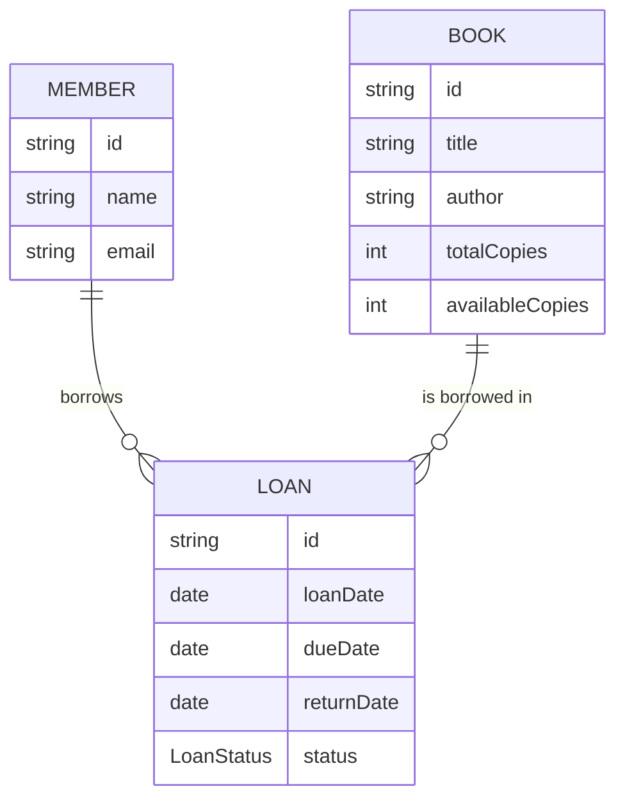
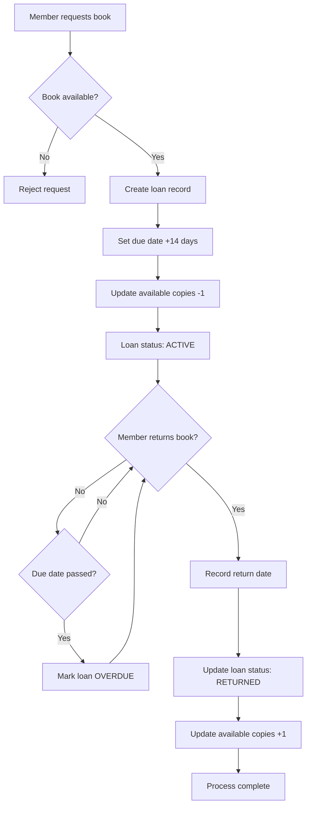

# ENSIT Library Service - Integration Testing Course Project

## General Context

This project is part of the ENSIT university curriculum for second-year students. Its main objective is to introduce students to the principles and practices of Integration Testing in software engineering, using a library management system as a case study.

## Library Management System Business Domain

### Overview

The library management system is designed to handle the core operations of a lending library. It manages a collection of books that can be borrowed by registered members, tracks loan periods, and handles the complete lifecycle of book borrowing from initial loan to return. The system supports multiple copies of the same book, maintains accurate inventory tracking, and enforces business rules around loan periods and availability.

### Core Business Entities

The system revolves around three primary entities that work together to facilitate library operations:

- **Book**: Represents physical books in the library's collection. Each book has a unique identifier, title, author, and maintains an inventory of total copies versus available copies for lending.
- **Member**: Represents library patrons who can borrow books. Each member has personal information including name and email for communication and tracking purposes.
- **Loan**: Represents the borrowing transaction that connects a specific book copy with a specific member. Loans track the borrowing date, due date (typically 14 days), return date, and current status.

### Business Rules and Operations

The system enforces several key business rules to maintain library integrity:

- Books can only be borrowed if copies are available
- Each loan has a standard 14-day period
- Loans can exist in three states: ACTIVE (currently borrowed), RETURNED (successfully returned), or OVERDUE (past due date)
- Members can have multiple active loans simultaneously
- The system must accurately track book inventory as loans are created and returned

### Key Business Processes

1. **Book Borrowing**: A member requests to borrow a book → System checks availability → Creates loan record → Updates book inventory
2. **Book Return**: Member returns a book → System validates active loan → Records return date → Updates loan status → Restores book availability
3. **Loan Management**: System can retrieve loan details, validate loan states, and track overdue items

### Entity Relationships



### Business Process Flow



This business domain provides an excellent foundation for learning integration testing, as it contains realistic scenarios with multiple entities, complex relationships, and business rules that require thorough validation across different system components.

## Installation Guide

### Prerequisites

Before setting up this project, ensure you have the following installed:

- Java 21
- Apache Maven 3.8.6

### Java 21 Installation

#### Windows

**Option 1: Using Chocolatey (Recommended)**

1. Install Chocolatey if not already installed: Follow instructions at [Chocolatey Installation](https://chocolatey.org/install)
2. Install OpenJDK 21: `choco install openjdk21`
3. Verify installation: Open Command Prompt and run `java -version`

**Option 2: Manual Installation**

1. Download Java 21 from [Oracle JDK 21](https://www.oracle.com/java/technologies/javase/jdk21-archive-downloads.html) or [OpenJDK](https://openjdk.java.net/install/)
2. Run the installer and follow the on-screen instructions
3. Set environment variables:
   - Set `JAVA_HOME` to the installation directory (e.g., `C:\Program Files\Java\jdk-21`)
   - Add `%JAVA_HOME%\bin` to the `PATH` environment variable
4. Verify installation: Open Command Prompt and run `java -version`

#### Linux (Ubuntu/Debian)

1. Update package list: `sudo apt update`
2. Install OpenJDK 21: `sudo apt install openjdk-21-jdk`
3. Verify installation: `java -version`

#### macOS

1. Install Homebrew if not already installed: `/bin/bash -c "$(curl -fsSL https://raw.githubusercontent.com/Homebrew/install/HEAD/install.sh)"`
2. Install OpenJDK 21: `brew install openjdk@21`
3. Add to PATH: `echo 'export PATH="/usr/local/opt/openjdk@21/bin:$PATH"' >> ~/.zshrc` (or ~/.bash_profile for bash)
4. Reload shell: `source ~/.zshrc`
5. Verify installation: `java -version`

### Apache Maven 3.8.6 (or higher) Installation

#### Windows

**Option 1: Using Chocolatey (Recommended)**

1. Install Chocolatey if not already installed: Follow instructions at [Chocolatey Installation](https://chocolatey.org/install)
2. Install Apache Maven 3.8.6 or higher: `choco install maven`
3. Verify installation: Open Command Prompt and run `mvn -version`

**Option 2: Manual Installation**

1. Download Apache Maven 3.8.6 from [Apache Maven Downloads](https://maven.apache.org/download.cgi)
2. Extract the zip file to a directory (e.g., `C:\apache-maven-3.8.6`)
3. Set environment variables:
   - Set `MAVEN_HOME` to the extraction directory
   - Add `%MAVEN_HOME%\bin` to the `PATH` environment variable
4. Verify installation: Open Command Prompt and run `mvn -version`

#### Linux

1. Download Apache Maven 3.8.6: `wget https://downloads.apache.org/maven/maven-3/3.8.6/binaries/apache-maven-3.8.6-bin.tar.gz`
2. Extract: `tar -xzf apache-maven-3.8.6-bin.tar.gz`
3. Move to /opt: `sudo mv apache-maven-3.8.6 /opt/`
4. Add to PATH: `echo 'export PATH="/opt/apache-maven-3.8.6/bin:$PATH"' >> ~/.bashrc`
5. Reload shell: `source ~/.bashrc`
6. Verify installation: `mvn -version`

#### macOS

1. Download Apache Maven 3.8.6 from [Apache Maven Downloads](https://maven.apache.org/download.cgi)
2. Extract the tar.gz file: `tar -xzf apache-maven-3.8.6-bin.tar.gz`
3. Move to /usr/local: `sudo mv apache-maven-3.8.6 /usr/local/apache-maven-3.8.6`
4. Add to PATH: `echo 'export PATH="/usr/local/apache-maven-3.8.6/bin:$PATH"' >> ~/.zshrc`
5. Reload shell: `source ~/.zshrc`
6. Verify installation: `mvn -version`

## Why Integration Tests Matter

Integration tests are automated tests that verify the interactions between different components of a system, including APIs, databases, and external services. They are essential for:

- **End-to-End Validation**: Integration tests ensure that different system components work together correctly, catching issues that unit tests might miss.
- **API Contract Verification**: They validate that REST endpoints behave correctly with real HTTP requests and responses, ensuring API reliability.
- **Database Integration**: Tests verify that data persistence, transactions, and queries work correctly with the actual database.
- **Real-World Scenarios**: Integration tests simulate actual user workflows, providing confidence that the system works as expected in production.
- **Cross-Layer Testing**: They test the complete request flow through controllers, services, repositories, and the database layer.

## Integration Testing Methodology

Integration testing follows a systematic approach to ensure all system components work together correctly:

### Testing Strategy

1. **Setup Test Environment**: Configure the test database, mock external services, and prepare test data.
2. **Test Complete Workflows**: Write tests that exercise entire user scenarios from HTTP request to database changes.
3. **Verify System State**: Check not just the response, but also side effects like database updates and service interactions.
4. **Clean Up**: Ensure tests are independent by properly cleaning up test data after each test.

### Integration Test Patterns

```
+------------------------+
|   HTTP Request         |
+------------------------+
          |
          v
+------------------------+
|   REST Controller      |
+------------------------+
          |
          v
+------------------------+
|   Service Layer        |
+------------------------+
          |
          v
+------------------------+
|   Repository Layer     |
+------------------------+
          |
          v
+------------------------+
|   Database             |
+------------------------+
```

### Best Practices

- **Test Real Scenarios**: Focus on testing actual business workflows rather than individual methods.
- **Use Test Containers**: Leverage tools like Testcontainers for database testing to ensure tests run in isolation.
- **Mock External Services**: Use WireMock or similar tools to simulate external API dependencies.
- **Data Isolation**: Each test should create its own test data and clean up afterwards.
- **Assertion Coverage**: Verify HTTP status codes, response bodies, database state, and any triggered side effects.

## Technical Documentation

### Tools & Technologies

- **Java**: Main programming language.
- **Maven**: Build automation and dependency management.
- **JUnit**: Testing framework for Java.
- **Mockito**: Mocking framework for integration tests.
- **REST Assured**: Testing framework for REST APIs.
- **Quarkus Test**: Framework for testing Quarkus applications with built-in test containers.

### How to Build & Test

- Build the project: `mvn clean install`
- Run tests: `mvn test`

## Project Structure & Application Layers

```
src/
  main/
    java/
      com/tuto/library/
        domain/      # Core entities (Book, Member, Loan, etc.)
        service/     # Business logic (BookService, LoanService, etc.)
        repository/  # Data access layer (BookRepository, etc.)
        resource/    # REST endpoints (BookResource, etc.)
        exception/   # Custom exceptions (BookNotFoundException, etc.)
  test/
    java/
      com/tuto/library/
        resource/    # Integration tests for REST endpoints
```

### Layered Architecture

- **Domain Layer**: Contains the main entities and their logic.
- **Service Layer**: Implements business rules and operations.
- **Exception Layer**: Defines custom exceptions for error handling.
- **Test Layer**: Contains integration tests for REST endpoints and complete workflows.

---

This project demonstrates best practices in integration testing, preparing students for professional software development with real-world testing scenarios.

## Integration Test Exercises

The following exercises are designed to help students practice writing integration tests for REST APIs. Each test should verify the complete flow from HTTP request through all layers to the database.

### Example Test (Already Implemented)

**Test**: `shouldReturnLoanAndUpdateBookAvailability_whenReturningActiveLoan` 
**Location**: `src/test/java/com/tuto/library/resource/LoanResourceIT.java`

This test demonstrates a complete integration test pattern:
- **Arrange**: Creates test data (Book, Member, Loan) using helper methods
- **Act**: Calls the REST endpoint using REST Assured
- **Assert**: Verifies both the HTTP response and database state changes

Study this test to understand:
- How to use `@Transactional` helper methods for test data setup
- How to make HTTP requests with REST Assured
- How to verify response status codes and body content
- How to check database state after the operation

### Instructor Demo Exercise

**TODO 1.0**: `shouldReturnNotFoundException_whenDeletingNonExistentMember`
**Location**: `src/test/java/com/tuto/library/resource/MemberResourceIT.java:18`

This test will be implemented by the instructor as a demonstration. It should:
- Test the DELETE endpoint for members
- Verify that attempting to delete a non-existent member returns a 404 NOT FOUND status
- Consider what ID to use for a member that doesn't exist
- Think about whether you need to create any test data first

### Student Exercises

#### TODO 1: Create Loan Test
**Test**: `shouldCreateLoan_whenValidBookAndMemberProvided`
**Location**: `src/test/java/com/tuto/library/resource/LoanResourceIT.java:37`

**Hints**:
- Use the existing helper methods to create a Book and Member
- Make a POST request to `/loans` with appropriate request body
- Verify the response status is 201 (CREATED)
- Check that the loan was persisted in the database
- Verify that the book's available copies decreased by 1

**Key Concepts**: HTTP POST requests, request body construction, status code verification, database state validation

#### TODO 2: Update Book Test
**Test**: `shouldUpdateBook_whenBookExistsAndValidDataProvided`
**Location**: `src/test/java/com/tuto/library/resource/BookResourceIT.java:30`

**Hints**:
- First create a book using the helper method
- Send a PUT request to update the book's information
- Use `ContentType.JSON` for the request
- Verify the response contains the updated information
- Check the database to ensure changes were persisted

**Key Concepts**: HTTP PUT requests, JSON content type, updating existing resources

#### TODO 3: Update Overdue Loans Test
**Test**: `shouldUpdateOverdueLoans_whenLoansArePastDueDate`
**Location**: `src/test/java/com/tuto/library/resource/LoanResourceIT.java:59`

**Hints**:
- Use the `createLoanWithDueDate` helper method (already provided)
- Create loans with different due dates: some in the past (overdue) and some in the future (current)
- Call the PUT endpoint `/loans/update-overdue`
- Verify that only loans with past due dates are marked as OVERDUE
- Check that current loans remain ACTIVE
- The test structure hints are already provided in comments

**Key Concepts**: Batch operations, date handling in tests, selective updates based on business rules

### Testing Best Practices to Follow

1. **Test Independence**: Each test should create its own test data and not depend on other tests
2. **Clear Test Names**: Use the pattern `should{ExpectedBehavior}_when{Condition}`
3. **Arrange-Act-Assert**: Structure your tests clearly with these three phases
4. **Verify Multiple Aspects**: Check both API responses and database state
5. **Use Helper Methods**: Leverage the provided `@Transactional` helper methods for data setup
6. **Clean Test Data**: Let Quarkus handle transaction rollback to keep tests isolated

### Common REST Assured Patterns

```java
// GET request example
given()
    .when().get("/endpoint/{id}", id)
    .then()
    .statusCode(200)
    .body("field", is(expectedValue));

// POST request example  
given()
    .contentType(ContentType.JSON)
    .body(requestObject)
    .when().post("/endpoint")
    .then()
    .statusCode(201);

// PUT request example
given()
    .contentType(ContentType.JSON)
    .body(updateObject)
    .when().put("/endpoint/{id}", id)
    .then()
    .statusCode(200);

// DELETE request example
given()
    .when().delete("/endpoint/{id}", id)
    .then()
    .statusCode(204);
```

Remember: Integration tests verify that all components work together correctly. Focus on testing complete user scenarios rather than individual components in isolation.
