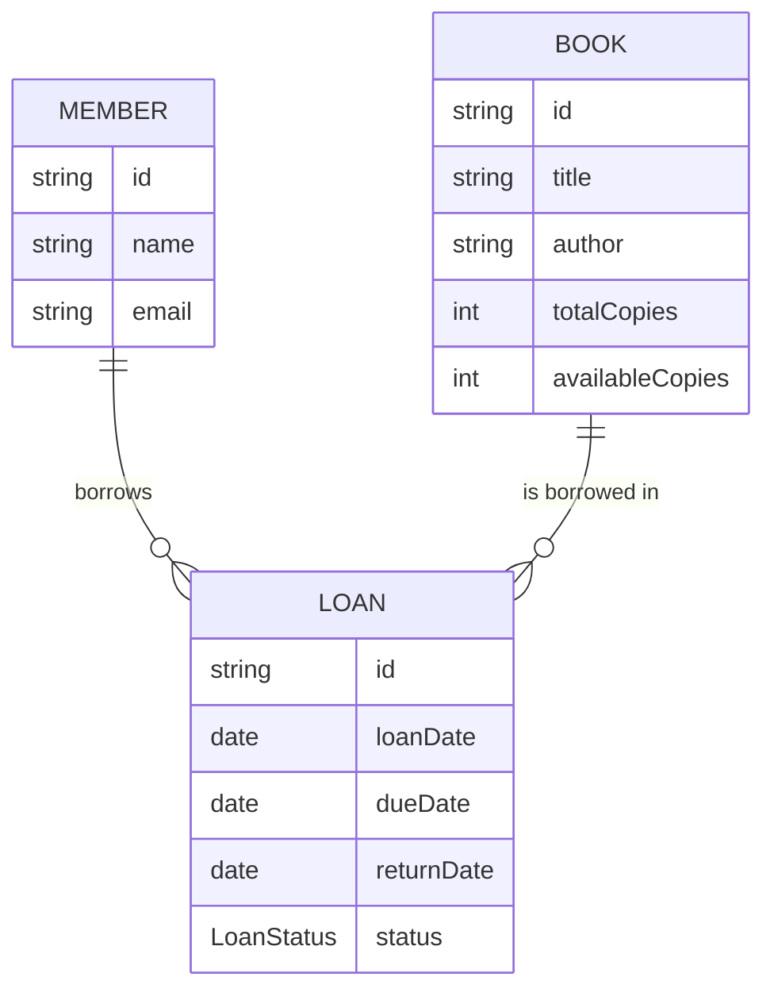
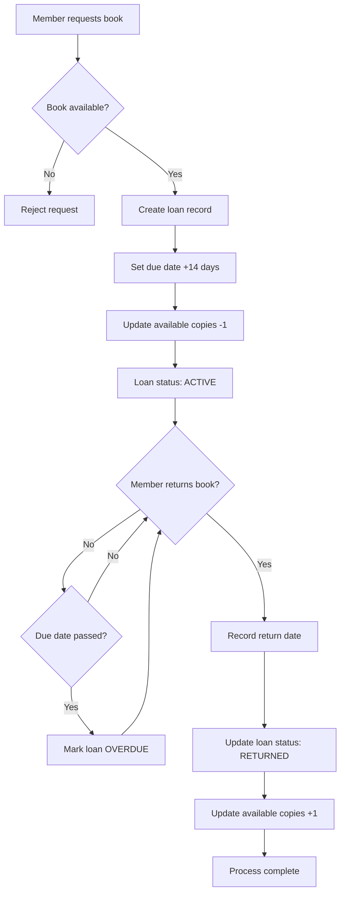

# ENSIT Library Service - Unit Testing & TDD Course Project

## General Context

This project is part of the ENSIT university curriculum for second-year students. Its main objective is to introduce students to the principles and practices of Unit Testing and Test-Driven Development (TDD) in software engineering, using a library management system as a case study.

## Library Management System Business Domain

### Overview

The library management system is designed to handle the core operations of a lending library. It manages a collection of books that can be borrowed by registered members, tracks loan periods, and handles the complete lifecycle of book borrowing from initial loan to return. The system supports multiple copies of the same book, maintains accurate inventory tracking, and enforces business rules around loan periods and availability.

### Core Business Entities

The system revolves around three primary entities that work together to facilitate library operations:

- **Book**: Represents physical books in the library's collection. Each book has a unique identifier, title, author, and maintains an inventory of total copies versus available copies for lending.
- **Member**: Represents library patrons who can borrow books. Each member has personal information including name and email for communication and tracking purposes.
- **Loan**: Represents the borrowing transaction that connects a specific book copy with a specific member. Loans track the borrowing date, due date (typically 14 days), return date, and current status.

### Business Rules and Operations

The system enforces several key business rules to maintain library integrity:

- Books can only be borrowed if copies are available
- Each loan has a standard 14-day period
- Loans can exist in three states: ACTIVE (currently borrowed), RETURNED (successfully returned), or OVERDUE (past due date)
- Members can have multiple active loans simultaneously
- The system must accurately track book inventory as loans are created and returned

### Key Business Processes

1. **Book Borrowing**: A member requests to borrow a book → System checks availability → Creates loan record → Updates book inventory
2. **Book Return**: Member returns a book → System validates active loan → Records return date → Updates loan status → Restores book availability
3. **Loan Management**: System can retrieve loan details, validate loan states, and track overdue items

### Entity Relationships



### Business Process Flow



This business domain provides an excellent foundation for learning unit testing and TDD, as it contains realistic scenarios with multiple entities, complex relationships, and business rules that require thorough validation.

## Installation Guide

### Prerequisites

Before setting up this project, ensure you have the following installed:

- Java 21
- Apache Maven 3.8.6

### Java 21 Installation

#### Windows

**Option 1: Using Chocolatey (Recommended)**

1. Install Chocolatey if not already installed: Follow instructions at [Chocolatey Installation](https://chocolatey.org/install)
2. Install OpenJDK 21: `choco install openjdk21`
3. Verify installation: Open Command Prompt and run `java -version`

**Option 2: Manual Installation**

1. Download Java 21 from [Oracle JDK 21](https://www.oracle.com/java/technologies/javase/jdk21-archive-downloads.html) or [OpenJDK](https://openjdk.java.net/install/)
2. Run the installer and follow the on-screen instructions
3. Set environment variables:
   - Set `JAVA_HOME` to the installation directory (e.g., `C:\Program Files\Java\jdk-21`)
   - Add `%JAVA_HOME%\bin` to the `PATH` environment variable
4. Verify installation: Open Command Prompt and run `java -version`

#### Linux (Ubuntu/Debian)

1. Update package list: `sudo apt update`
2. Install OpenJDK 21: `sudo apt install openjdk-21-jdk`
3. Verify installation: `java -version`

#### macOS

1. Install Homebrew if not already installed: `/bin/bash -c "$(curl -fsSL https://raw.githubusercontent.com/Homebrew/install/HEAD/install.sh)"`
2. Install OpenJDK 21: `brew install openjdk@21`
3. Add to PATH: `echo 'export PATH="/usr/local/opt/openjdk@21/bin:$PATH"' >> ~/.zshrc` (or ~/.bash_profile for bash)
4. Reload shell: `source ~/.zshrc`
5. Verify installation: `java -version`

### Apache Maven 3.8.6 (or higher) Installation

#### Windows

**Option 1: Using Chocolatey (Recommended)**

1. Install Chocolatey if not already installed: Follow instructions at [Chocolatey Installation](https://chocolatey.org/install)
2. Install Apache Maven 3.8.6 or higher: `choco install maven`
3. Verify installation: Open Command Prompt and run `mvn -version`

**Option 2: Manual Installation**

1. Download Apache Maven 3.8.6 from [Apache Maven Downloads](https://maven.apache.org/download.cgi)
2. Extract the zip file to a directory (e.g., `C:\apache-maven-3.8.6`)
3. Set environment variables:
   - Set `MAVEN_HOME` to the extraction directory
   - Add `%MAVEN_HOME%\bin` to the `PATH` environment variable
4. Verify installation: Open Command Prompt and run `mvn -version`

#### Linux

1. Download Apache Maven 3.8.6: `wget https://downloads.apache.org/maven/maven-3/3.8.6/binaries/apache-maven-3.8.6-bin.tar.gz`
2. Extract: `tar -xzf apache-maven-3.8.6-bin.tar.gz`
3. Move to /opt: `sudo mv apache-maven-3.8.6 /opt/`
4. Add to PATH: `echo 'export PATH="/opt/apache-maven-3.8.6/bin:$PATH"' >> ~/.bashrc`
5. Reload shell: `source ~/.bashrc`
6. Verify installation: `mvn -version`

#### macOS

1. Download Apache Maven 3.8.6 from [Apache Maven Downloads](https://maven.apache.org/download.cgi)
2. Extract the tar.gz file: `tar -xzf apache-maven-3.8.6-bin.tar.gz`
3. Move to /usr/local: `sudo mv apache-maven-3.8.6 /usr/local/apache-maven-3.8.6`
4. Add to PATH: `echo 'export PATH="/usr/local/apache-maven-3.8.6/bin:$PATH"' >> ~/.zshrc`
5. Reload shell: `source ~/.zshrc`
6. Verify installation: `mvn -version`

## Why Unit Tests Matter

Unit tests are automated tests written to verify the behavior of small units of code (usually methods or classes). They are essential for:

- **Fearless Refactoring**: With a solid suite of unit tests, developers can change code confidently, knowing that regressions will be caught early.
- **Bug Prevention**: Unit tests catch bugs before code reaches production, reducing maintenance costs and improving reliability.
- **Documentation**: Tests serve as living documentation, showing how code is intended to be used.
- **Faster Development**: Automated tests speed up development by providing instant feedback.

## Test-Driven Development (TDD)

TDD is a software development approach where tests are written before the code itself. The TDD cycle consists of three steps:

1. **Red**: Write a failing test for a new feature.
2. **Green**: Write the minimum code necessary to make the test pass.
3. **Refactor**: Clean up the code, ensuring all tests still pass.

```
+-------------------+
|   Write Test      |
+-------------------+
          |
          v
+-------------------+
|   Run Test (Red)  |
+-------------------+
          |
          v
+-------------------+
|   Write Code      |
+-------------------+
          |
          v
+-------------------+
|   Run Test (Green)|
+-------------------+
          |
          v
+-------------------+
|   Refactor        |
+-------------------+
          |
          v
   (Repeat Cycle)
```

TDD leads to better-designed, more maintainable, and bug-free code.

## Technical Documentation

### Tools & Technologies

- **Java**: Main programming language.
- **Maven**: Build automation and dependency management.
- **JUnit**: Unit testing framework for Java.
- **Mockito**: Mocking framework for unit tests.

### How to Build & Test

- Build the project: `mvn clean install`
- Run tests: `mvn test`

## Project Structure & Application Layers

```
src/
  main/
    java/
      com/tuto/library/
        domain/      # Core entities (Book, Member, Loan, etc.)
        service/     # Business logic (BookService, LoanService, etc.)
        exception/   # Custom exceptions (BookNotFoundException, etc.)
  test/
    java/
      com/tuto/library/
        service/     # Unit tests for services
```

### Layered Architecture

- **Domain Layer**: Contains the main entities and their logic.
- **Service Layer**: Implements business rules and operations.
- **Exception Layer**: Defines custom exceptions for error handling.
- **Test Layer**: Contains unit tests for all major components.

---

This project demonstrates best practices in unit testing and TDD, preparing students for professional software development.

## Exercise TODOs for Instructor

The following TODOs are marked for the instructor (Mohamed Sayed) to complete as demonstration exercises for students:

### TODO 1.0: MemberServiceTest
**Location**: `src/test/java/com/tuto/library/service/MemberServiceTest.java:20`
- **Test Method**: `shouldThrowMemberNotFoundException_whenDeletingNonExistentMember()`
- **Learning Objective**: This test showcases how to verify exception throwing when operations are performed on non-existent entities. It teaches proper exception testing patterns and repository mocking techniques.

### TODO 2.0: Exception Testing
- **Test Method**: `shouldThrowBookNotFoundException_whenReturningBookByIdThatDoesNotExist()`
- **Learning Objective**: Similar to the Member test, this demonstrates testing for exceptions when retrieving non-existent resources. The TDD approach means writing this test before implementing the actual service method.

## Exercise TODOs for Students

### TODO 1: LoanServiceTest
**Location**: `src/test/java/com/tuto/library/service/LoanServiceTest.java:43`
- **Test Method**: `shouldThrowInvalidLoanOperationException_whenReturningNonActiveLoan()`
- **Learning Objective**: This test demonstrates exception handling when attempting invalid operations on loans. Students will learn how to test scenarios where business rules are violated (e.g., returning a book that isn't currently on loan or has already been returned).

### TODO 2: BookServiceTest (TDD Approach)
**Location**: `src/test/java/com/tuto/library/service/BookServiceTest.java`

The BookService tests should be implemented using the Test-Driven Development (TDD) approach:

- `shouldReturnTrue_whenBookIsAvailable()` - Tests availability checking logic
- `shouldDecreaseAvailableCopies_whenBorrowingBook()` - Tests inventory management during borrowing
- `shouldThrowBookNotAvailableException_whenBorrowingBookWithNoCopies()` - Tests exception handling for unavailable books
- `shouldIncreaseAvailableCopies_whenReturningBook()` - Tests inventory restoration when books are returned
- `shouldThrowInvalidLoanOperationException_whenReturningBookWithMaxCopies()` - Tests boundary condition when attempting to return a book that already has all copies available


**TDD Process Reminder for Students**: 
1. Watch as the instructor writes the failing test first (Red phase)
2. Observe the minimal implementation to make the test pass (Green phase)  
3. See how the code is refactored while keeping tests green (Refactor phase)

These exercises will demonstrate key testing concepts including:
- Mocking dependencies with Mockito
- Verifying exception scenarios
- Testing state changes in domain objects
- Following the TDD cycle systematically
